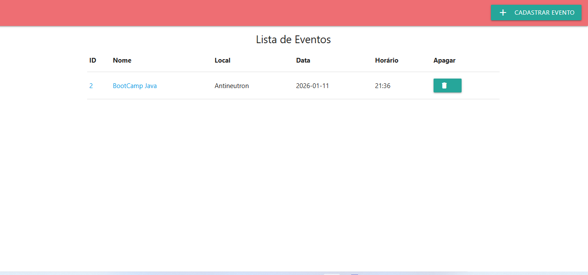

# 📅 EventoApp - Gestão de Eventos e Convidados

O **EventoApp** é uma aplicação Full Stack desenvolvida em Java com Spring Boot que permite o gerenciamento completo de eventos e seus respectivos convidados. A aplicação foi projetada para ser leve, funcional e está pronta para produção.

---

## 🚀 Tecnologias Utilizadas

- **Java 17** (LTS)
- **Spring Boot 3.x**
- **Spring Data JPA** (Persistência de dados)
- **Thymeleaf** (Motor de templates HTML)
- **Materialize CSS** (Design Responsivo)
- **PostgreSQL** (Banco de dados de produção)
- **Docker** (Containerização)
- **Maven** (Gerenciador de dependências)

---

## 🛠️ Funcionalidades

- [x] **Cadastro de Eventos:** Adicione nome, local, data e horário.
- [x] **Listagem de Eventos:** Visualize todos os eventos cadastrados em tempo real.
- [x] **Edição de Eventos:** Altere informações de eventos já existentes.
- [x] **Gestão de Convidados:** Adicione convidados específicos a cada evento (com validação).
- [x] **Exclusão:** Remova eventos ou convidados de forma rápida.
- [x] **Persistência de Dados:** Dados salvos de forma segura no PostgreSQL.

---

## 📸 Demonstração

### Tela Inicial (Lista de Eventos)


### Detalhes do Evento e Convidados


## 🌍 Deploy (Produção)

A aplicação está hospedada no **Render**. Graças à containerização com Docker, o ambiente de produção é idêntico ao de desenvolvimento.

- **Plataforma:** [Render](render.com)
- **Banco de Dados:** [Render Postgres](render.comdocs/databases)
- **CI/CD:** Deploy automático via GitHub.

---

## 💻 Como rodar o projeto localmente

### Pré-requisitos
- JDK 17 ou superior
- Maven instalado
- Banco de dados PostgreSQL (ou altere para H2/MySQL se preferir)

### Passo a passo
1. Clone o repositório:
   ```bash
   git clone github.com
2. Configure as variáveis de ambiente no seu application.properties ou no seu sistema:
 a. SPRING_DATASOURCE_URL

 b. SPRING_DATASOURCE_USERNAME
 
 c. SPRING_DATASOURCE_PASSWORD
 
4. Execute a aplicação via Maven:
   #bash: mvn spring-boot:run
5. Acesse no navegador: http://localhost:8080/eventos
## 📄 Licença
Este projeto está sob a licença MIT.

Feito com por D. Baptista
